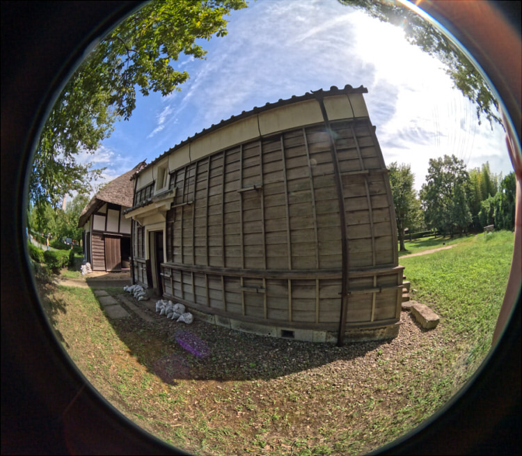
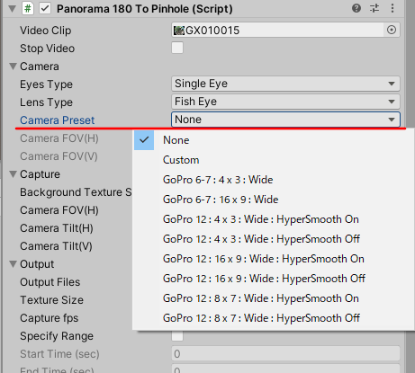
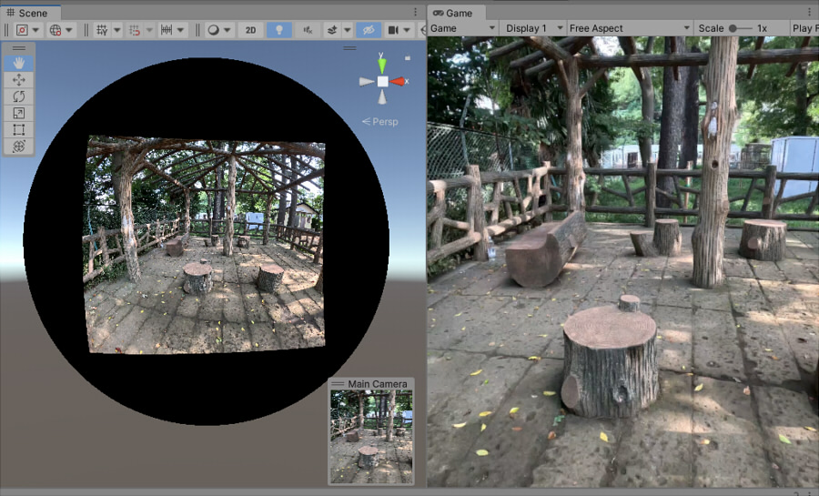

# 概要

Panorama180 To Pinholeは、パノラマ180のSideBySide、またはFishEyeの動画から1フレーム5枚のPinholeとしてのキャプチャを行いファイル出力するアセットです。     
パノラマ画像は魚眼のゆがみがありますが、これをゆがみのない画像にして出力します。     

元の動画は以下のようなEquirectangularで180度分を使用した、ステレオの配置を使用できます。      
     
この左側の画像が使用されます。     

また、単眼の指定や魚眼の指定にも対応しています。      
以下は単眼 + 魚眼の例です。     
     

## 開発環境

* Windows 10
* Unity 2022.3.6f1 (URP)

## 使い方

Unity Editorの**URP**に対応しています。      

### プロジェクトにPanorama180 To Pinholeを追加

"[Panorama180ToPinhole](https://github.com/ft-lab/Unity_Panorama180ToPinhole/tree/main/Assets/Panorama180ToPinhole)"フォルダをUnityのプロジェクトにドロップして配置します。     
     

### 新規シーンを作成

新しいシーンを作成します。     
Post Processingの影響を受けないように、"Global Volume"を選択してInspectorウィンドウよりTonemappingやBloomを無効にしました。      
     

### カメラのコンポーネントに"Panorama180ToPinhole"を追加

"Main Camera"を選択し、Inspectorウィンドウで"Add Component"ボタンを押します。     
     
Scriptsより"Panorama180ToPinhole" - "Panorama180ToPinhole"を選択します。     

Panorama180ToPinholeコンポーネントが追加されました。     
     

パノラマ180(SideBySide)の動画をプロジェクトにインポートします。      
これをPanorama180 To Pinholeコンポーネントの"Video Clip"にドロップします。     
     

### Play

Playすると、はじめにパノラマ動画が読み込まれ、"Output Path"で指定されたパス（デフォルトはプロジェクトの"Output"フォルダ内）にフレーム間ごとのjpeg画像が出力されます。     
     

出力される静止画は、     
* 正面
* Y軸中心回転で左向き
* Y軸中心回転で右向き
* X軸中心回転で上向き
* X軸中心回転で下向き

の5方向の画像が出力されます。     
     
すべての画像が出力されると、Consoleウィンドウに"Finished!"と表示されます。     
これが表示されたら、Playを停止してください。    

## GoPro広角の場合の視野角度を指定

GoProの場合は、"Eyes Type"は"Single Eye"、"Lens Type"は"Fish Eye"を指定します。      
また、広角の場合は"Camera Preset"で視野角度を指定することで、完全な魚眼でない場合でもPinholeとしての画像を得ることができます。     
"Camera Preset"では、いくつかプリセットを用意しています。      
     
もし、別のGoProのバージョンの場合は"Custom"を選択することで、"Camera FOV(H)"、"Camera FOV(V)"を個別に調整できます。     
これは水平、垂直方向の視野角度を度数で指定します。      

以下は、GoPro12で広角 8x7、HyperSmooth On で撮影したものを使用しました。     
     

この視野角度の指定は、GoProの"広角"で使用できる点に注意してください。     
加工が入ったリニアやHyperView、SuperViewでは使用できません。     

Max Lens Mod 1または2を使用して魚眼で使用する場合は、GoPro本体のMaxレンズをオフにして純粋な魚眼のみを使用。     
Panorama180 To Pinholeの"Camera Preset"は"None"を指定するようにしてください。      

参考 : https://community.gopro.com/s/article/HERO12-Black-Digital-Lenses-FOV-Information?language=ja     

## パラメータ

Panorama180ToPinholeコンポーネントのパラメータの説明です。     

### 共通パラメータ

|パラメータ名|説明|     
|---|---|     
|Video Clip|パノラマ180ステレオ(Side By Side)の動画、 FishEyeの動画を指定。 単眼、パノラマのどちらでも指定できます。|     
|Stop Video|再生中の動画を一時停止します。|     

### Camera

|パラメータ名|説明|     
|---|---|     
|Eye Type|Single Eye : 動画は単眼 Two Sides(Side By Side) : 動画はステレオ（Side By Side）|     
|Lens Type|EquirectangularまたはFish Eyeを選択。|     
|Camera Preset|GoProの場合の視野角度のプリセットを選択。|     
|Camera FOV(H)|"Camera Preset"がOnの場合、水平視野角度を指定。|     
|Camera FOV(V)|"Camera Preset"がOnの場合、垂直視野角度を指定。|     

### Capture

|パラメータ名|説明|     
|---|---|     
|Background Texture Size|半球に投影する背景のテクスチャサイズを指定|     
|Camera FOV(H)|Pinhole画像を作成するカメラの垂直視野角度（度数）|     
|Capture Left/Right|左右に向いた画像をキャプチャ。デフォルトOn。|     
|Capture Top/Bottom|上下に向いた画像をキャプチャ。デフォルトOn。|     
|Camera Tilt(H)|カメラの視線方向からの水平の向きのずれ（度数）  左右のカメラである"camera_1"、"camera_2"はY軸中心で指定の角度分傾きます。|     
|Camera Tilt(V)|カメラの視線方向からの垂直の向きのずれ（度数） 上下のカメラである"camera_3"、"camera_4"はX軸中心で指定の角度分傾きます。|     

"Capture Left/Right"チェックボックスをOnにすることで、"Camera Tilt(H)"の向きだけ水平方向に傾けた画像を出力します。     
"Capture Top/Bottom"チェックボックスをOnにすることで、"Camera Tilt(V)"の向きだけ垂直方向に傾けた画像を出力します。     
もし、1フレーム出力するときに正面だけを出力したい場合は、"Capture Left/Right"と"Capture Top/Bottom"チェックボックスをOffにするようにしてください。      

### Output

|パラメータ名|説明|     
|---|---|     
|Output Files|Pinholeの静止画を出力する場合はOnにします。|     
|Texture Size|出力するテクスチャサイズをピクセル数で指定|     
|Capture fps|1秒でサンプリングするフレーム数。 1.0の場合は、1秒ごとに1フレーム分（合計5枚）が出力されることになります。|     
|Specify Range|Onにすると、キャプチャ動画の開始時間と終了時間を指定します。|     
|Start Time (sec)|"Specify Range"がOnの場合、開始時間を指定します。|     
|End Time (sec)|"Specify Range"がOnの場合、終了時間を指定します。|     
|Output Path|出力フォルダ。 相対パスで指定した場合は、Projectのルートからのパスになります。絶対パス指定も可能です。|     

## 更新履歴

* [更新履歴](./ChangeLog.md)    
