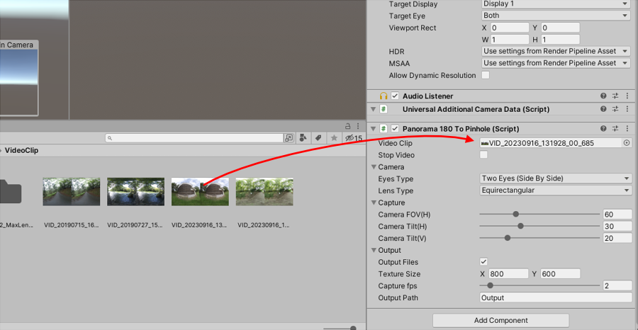

# 概要

Panorama180 To Pinholeは、パノラマ180のSideBySideの動画から1フレーム5枚のPinholeとしてのキャプチャを行いファイル出力するアセットです。     
パノラマ画像は魚眼のゆがみがありますが、これをゆがみのない画像にして出力します。     

元の動画は以下のようなEquirectangularで180度分を使用した、ステレオの配置です。      
     
この左側の画像が使用されます。     

## 開発環境

* Windows 10
* Unity 2022.3.6f1 (URP)

## 使い方

Unity Editorの**URP**に対応しています。      

### プロジェクトにPanorama180 To Pinholeを追加

"Panorama180ToPinhole"フォルダをUnityのプロジェクトにドロップして配置します。     
     

### 新規シーンを作成

新しいシーンを作成します。     
Post Processingの影響を受けないように、"Global Volume"を選択してInspectorウィンドウよりTonemappingやBloomを無効にしました。      
     

### カメラのコンポーネントに"Panorama180ToPinhole"を追加

"Main Camera"を選択し、Inspectorウィンドウで"Add Component"ボタンを押します。     
     
Scriptsより"Panorama180ToPinhole" - "Panorama180ToPinhole"を選択します。     

Panorama180ToPinholeコンポーネントが追加されました。     
     

パノラマ180(SideBySide)の動画をプロジェクトにインポートします。      
これをPanorama180ToPinholeコンポーネントの"VR180 Video Clip"にドロップします。     
     

### Play

Playすると、はじめにパノラマ動画が読み込まれ、"Output Path"で指定されたパス（デフォルトはプロジェクトの"Output"フォルダ内）にフレーム間ごとのjpeg画像が出力されます。     
     

出力される静止画は、     
* 正面
* Y軸中心回転で左向き
* Y軸中心回転で右向き
* X軸中心回転で上向き
* X軸中心回転で下向き

の5方向の画像が出力されます。     
     
すべての画像が出力されると、Consoleウィンドウに"Finished!"と表示されます。     
これが表示されたら、Playを停止してください。    

## パラメータ

Panorama180ToPinholeコンポーネントのパラメータの説明です。     

|パラメータ名|説明|     
|---|---|     
|VR180 Video Clip|パノラマ180ステレオ(Side By Side)の動画|     
|Camera FOV|Pinhole画像を作成するカメラの視野角度（度数）|     
|Camera Tilt|カメラの視線方向からの向きのずれ（度数）  左右のカメラである"camera_1"、"camera_2"はY軸中心で指定の角度分傾きます。 上下のカメラである"camera_3"、"camera_4"はX軸中心で指定の角度分傾きます。|     
|Texture Size|出力するテクスチャサイズをピクセル数で指定|     
|Capture FPS|1秒でサンプリングするフレーム数。 1.0の場合は、1秒ごとに1フレーム分（合計5枚）ごとに出力されることになります。|     
|Output Path|出力フォルダ。 相対パスで指定した場合は、Projectのルートからの相対パス指定になります。|     

