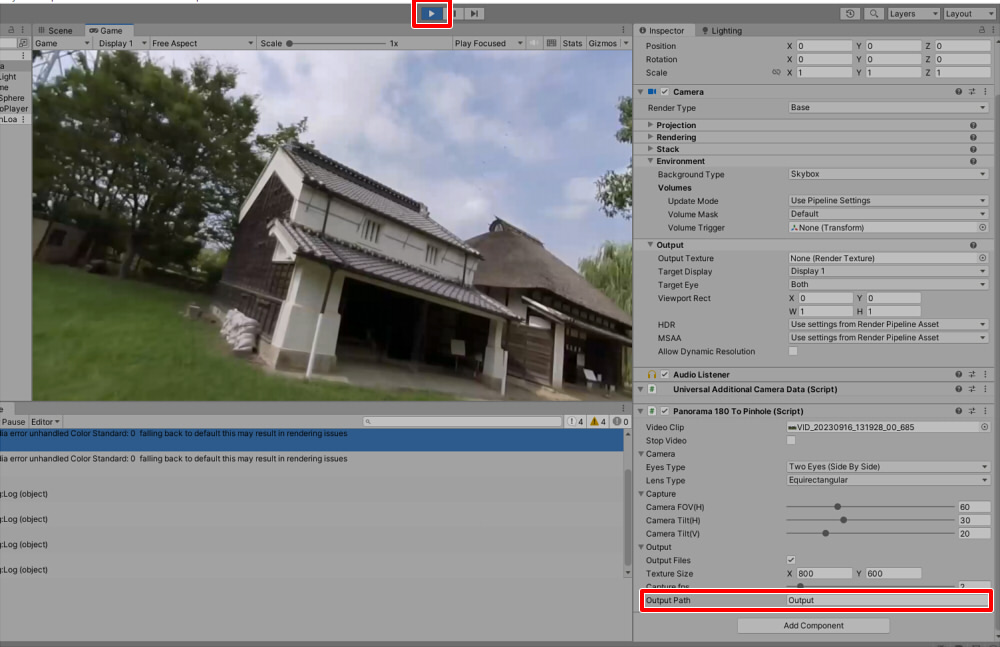

# 概要

Panorama180 To Pinholeは、パノラマ180のSideBySide、またはFishEyeの動画から1フレーム5枚のPinholeとしてのキャプチャを行いファイル出力するアセットです。     
パノラマ画像は魚眼のゆがみがありますが、これをゆがみのない画像にして出力します。     

元の動画は以下のようなEquirectangularで180度分を使用した、ステレオの配置です。      
     
この左側の画像が使用されます。     

また、単眼の指定にも対応しています。      

## 開発環境

* Windows 10
* Unity 2022.3.6f1 (URP)

## 使い方

Unity Editorの**URP**に対応しています。      

### プロジェクトにPanorama180 To Pinholeを追加

"[Panorama180ToPinhole](https://github.com/ft-lab/Unity_Panorama180ToPinhole/tree/main/Assets/Panorama180ToPinhole)"フォルダをUnityのプロジェクトにドロップして配置します。     
     

### 新規シーンを作成

新しいシーンを作成します。     
Post Processingの影響を受けないように、"Global Volume"を選択してInspectorウィンドウよりTonemappingやBloomを無効にしました。      
     

### カメラのコンポーネントに"Panorama180ToPinhole"を追加

"Main Camera"を選択し、Inspectorウィンドウで"Add Component"ボタンを押します。     
     
Scriptsより"Panorama180ToPinhole" - "Panorama180ToPinhole"を選択します。     

Panorama180ToPinholeコンポーネントが追加されました。     
     

パノラマ180(SideBySide)の動画をプロジェクトにインポートします。      
これをPanorama180 To Pinholeコンポーネントの"Video Clip"にドロップします。     
     

### Play

Playすると、はじめにパノラマ動画が読み込まれ、"Output Path"で指定されたパス（デフォルトはプロジェクトの"Output"フォルダ内）にフレーム間ごとのjpeg画像が出力されます。     
     

出力される静止画は、     
* 正面
* Y軸中心回転で左向き
* Y軸中心回転で右向き
* X軸中心回転で上向き
* X軸中心回転で下向き

の5方向の画像が出力されます。     
     
すべての画像が出力されると、Consoleウィンドウに"Finished!"と表示されます。     
これが表示されたら、Playを停止してください。    

## パラメータ

Panorama180ToPinholeコンポーネントのパラメータの説明です。     

|パラメータ名|説明|     
|---|---|     
|Video Clip|パノラマ180ステレオ(Side By Side)の動画、 FishEyeの動画を指定。 単眼、パノラマのどちらでも指定できます。|     
|Stop Video|再生中の動画を一時停止します。|     
|Camera - Eye Type|Single Eye : 動画は単眼 Two Sides(Side By Side) : 動画はステレオ（Side By Side）|     
|Camera - Lens Type|EquirectangularまたはFish Eyeを選択。|     
|Capture - Camera FOV(H)|Pinhole画像を作成するカメラの垂直視野角度（度数）|     
|Capture - Camera Tilt(H)|カメラの視線方向からの水平の向きのずれ（度数）  左右のカメラである"camera_1"、"camera_2"はY軸中心で指定の角度分傾きます。|     
|Capture - Camera Tilt(V)|カメラの視線方向からの垂直の向きのずれ（度数） 上下のカメラである"camera_3"、"camera_4"はX軸中心で指定の角度分傾きます。|     
|Output - Output Files|Pinholeの静止画を出力する場合はOnにします。|     
|Output - Texture Size|出力するテクスチャサイズをピクセル数で指定|     
|Output - Capture fps|1秒でサンプリングするフレーム数。 1.0の場合は、1秒ごとに1フレーム分（合計5枚）が出力されることになります。|     
|Output - Output Path|出力フォルダ。 相対パスで指定した場合は、Projectのルートからのパスになります。絶対パス指定も可能です（フォルダ選択のUIは作ってません、、、）。|     

